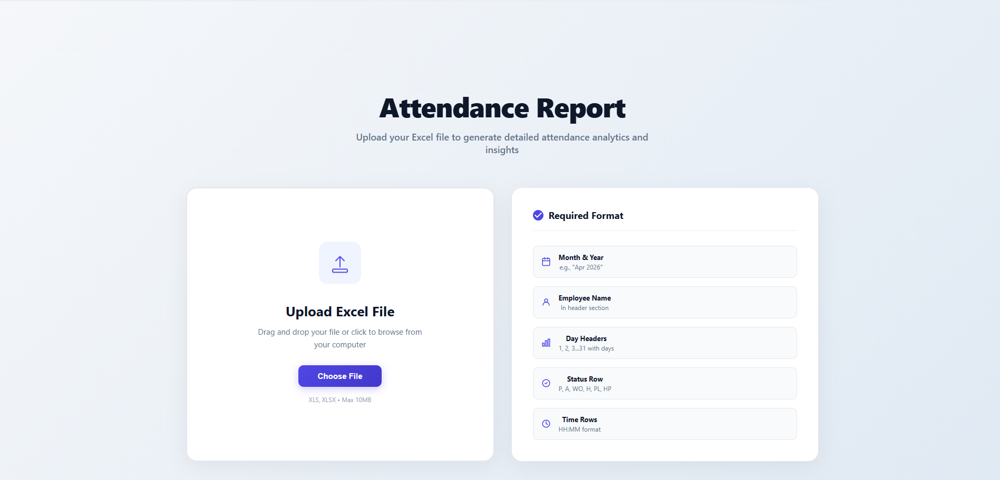
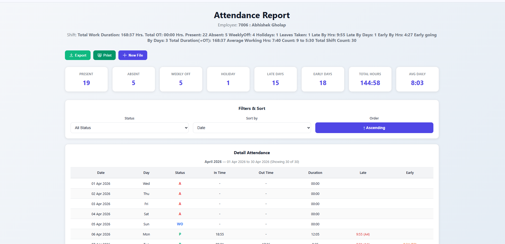
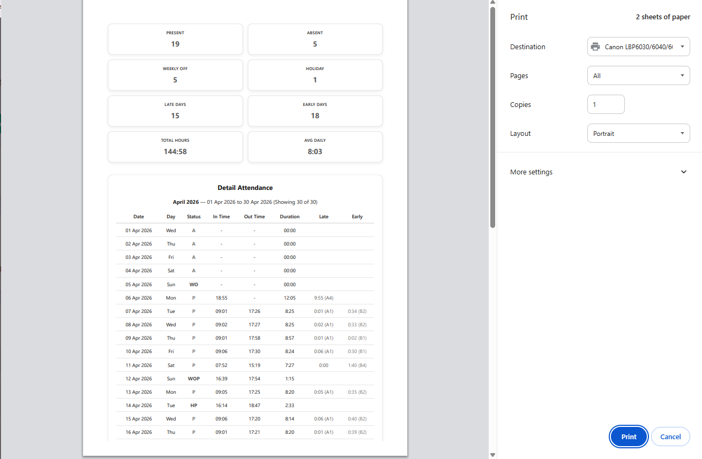

# Attendance Master - Quick Reference Guide

> Version 1.0 | Last Updated: May 2026 | © 2026 Attendance Master

---

# 📱 System Requirements

- Web browser:
  - Chrome
  - Firefox
  - Safari
  - Edge
- Internet connection
- Excel file (`.xls` or `.xlsx`)
- Maximum file size: **10MB**
- No installation required

---

# 🚀 Quick Start (3 Steps)

1. Open the application
2. Click **"Choose File"** or drag & drop your Excel file
3. View your attendance report instantly

**⏱️ Processing Time:** 1–2 seconds

---

# 📊 What You Get In Your Report

## Summary Statistics (8 Cards)

- Present Days
- Absent Days
- Late Days Count
- Total Working Hours
- Weekly Off Days
- Holiday Count
- Early Days Count
- Avg Daily Hours

---

## Detailed Table

| Date | Day | Status | InTime | OutTime | Duration |
|------|-----|--------|--------|---------|----------|

Additional Details:
- Late Time & Status (`A1 / A2 / A3 / A4`)
- Early Time & Status (`B1 / B2 / B3 / B4`)

---

## Filters & Sort

### Filter By
- All
- P
- A
- WO
- H
- PL
- HP

### Sort By
- Date
- Status
- Late Time
- Early Time

### Order
- Ascending
- Descending

---

# 📋 Excel File Format Checklist

## Required Elements

- [ ] Month & Year (Example: `Apr 2026`) — Must be within first 12 rows
- [ ] Employee Name with `Employee:` label in first 20 rows
- [ ] Shift Details (Optional) with `Shift:` label
- [ ] Day Headers numbered `1–31`
- [ ] Status Row labeled `Status`
- [ ] InTime Row labeled `InTime`
- [ ] OutTime Row labeled `OutTime`
- [ ] Duration Row (Optional) labeled `Duration`

---

# 📌 Status Codes

| Code | Meaning |
|------|----------|
| P | Present |
| A | Absent |
| WO | Weekly Off |
| WOP | Weekly Off - Present |
| H | Holiday |
| HP | Holiday Present |
| PL | Paid Leave / Personal Leave |
| C OFF | Compensatory Off |

---

# 📞 Support

**Email:** gholapabhishek9@gmail.com 
**Response Time:** 24–48 hours

---

## 📸 Data

### Dashboard

### Attendance Summary

### Print & Table

---

## 📂 Sample Excel File

Download sample file here:

[Sample Attendance Excel](sampledata/systemrepo.xls)

## 🚀 Hosting

[Open Attendance Master](https://attendance-master-ten.vercel.app/)

## 📘 Full Documentation

[Read Full User Manual](sampledata/Attendance_Calculator_User_Manual)

[Read Quick ref Guide](sampledata/Quick_Reference_Guide.txt)

---